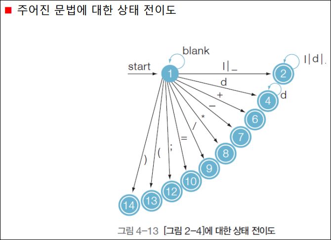

# 1강

- 기계어 vs 어셈블리어
  - 기계어 - 0101010
  - 어셈블리어 - 기계어의 가독성을 올리기 위한 저급 언어
- 어셈블러 vs 컴파일러
  - 어셈블러 - 어셈 to 기계어
  - 컴파일러 - 고급언어 to 저급언어
- `call by ref` vs `call by val` vs `call by name`
- block structure -> stack이 있어야
- array vs record
- 2 pass assembler
  - `1pass` - symbol table 작성(식별자 이름 - 주소)
  - `2pass` - opcode to 기계어


# 2강

1. Scanning or Lexical anal (**어휘 분석)**
   - `input` : sentence
   - `output` : '토큰'
2. Parging or Syntax anal (**구문 분석**)
   - `input` : 토큰
   - `output` : (문법에 맞으면) 파스트리, 구문트리, (문법에 안 맞으면) err msg
     - 파스트리 : 토큰이 터미널 노드인 트리
3. Semantic anal (**의미 분석**)
   - type chk
   - 파스트리에 attr를 추가
   - `input` : 파스트리
   - `output` : annotated 파스트리
4. Intermediate code
   - target machine에 dependant하지 않는 코드
5. Code opti
   - machine dependent opti, machine independent opti
   - local opti, global opti
6. Code gen
   - `input` : intermediate code
   - `output` : 기계어, 어셈블리어


예시 )

1. Scanning or Lexical anal (**어휘 분석**)

   - res = (id, 1), (=, ~), (id, 2),  ...
     - 여기서 번호는 identifier의 번호임. sym tab에 저장되어 있음

2. Parging or Syntax anal (**구문 분석**)

   - res = 

     

3. Semantic anal (**의미 분석**)

   - res = 

     

4. Intermediate code

   - res =

     ```shell
     t1 = id2 * id3
     t2 = intotofloat(60)
     .
     .
     id1 = t7
     ```

5. Code opti

   - 위 코드 줄어듦

6. Code gen

   ```assembly
   LOAD R1, id2
   LOAD R2, id3
   .
   .
   ```

   


# 3강

- `Alphabet`
  - 정의 : set of 기호
  - 표기 : $\Sigma$
- `String`
  - 정의 : seq of alphabet
  - Empty string 정의
    - 표기 : $\epsilon$
  - 연산
    - $w^R$ : reverse
    - $w^n$ : 거듭제곱
    - Prefix(string)
- `Language` : $\Sigma^*$의 부분집합
  - 연산
    - $\cup$ 
    - *
    - 거듭제곱 : recursive하게 정의
      1. $L^0\coloneqq {\epsilon}$
      2. $L^n\coloneqq LL^{n-1}$
         - $L^*$
         - $L^+$
- `Grammar`
  - G = ($V_n, V_T, P, S$)
  - 표기 : L(G)

# 4강

- Chomsky hierarchy
  - type 0 : 제약 없
    - 튜링머신이 생성할 수 있음
  - type 1 : aA -> bb
    - CSL(Context Sensitive Language) 
    - **linear bdd non-determinstic 튜링 머신**이 인식
  - type 2 : A -> aa
    - LHS에 논터미널 달랑하나
    - CFL(Context Free Grammar) 
    - **Non determinstic pushdown automata**가 인식
  - type 3 :
    - A -> tB
    - A -> t
    - **Finite State Automata**가 인식

- Notations for Grammar
  1. Reg expr
  2. Syntax Diagram
  3. BNF
  4. EBNF


# 5강

- Finite Automata
  - NFA
  - DFA
- FA : 상태가 유한 개
  - Formal Def 
    - M = (Q, $\Sigma$, $\delta$, $q_0$, F)
    - Q, $\Sigma$ 는 set이고, $q_0$는 원소 하나, F도 set
    - $\delta$를 제시할 때, table로 하면 좋은듯.
  - in NFA
    - $\delta$ : Q X ($\Sigma \cup \epsilon$) -> $2^Q$
- $\epsilon$ - closure(q)
  - q에서 꽁으로 갈 수 있는 state set


# 6강

- NFA to DFA

  - 뭉텅이를 하나의 state로 만들어 주는 것에 불과

- State minimization

  - distinguishable은 냅두고, indistinguishable을 합치는 거
  - equivalence set을 계속 쪼갬

- 3위 일체

  - RG => RE 
    - X = $\alpha$X + $\beta$의 해는 $\alpha^*\beta$ 인 사실 이용
  - RE => FA
    - 1대1로 매칭되는 그림 암기
    - N1 + N2, N1N2, $N1^{*}$
  - FA => RG
    - 간단한 규칙
      - Q = $V_N$
      - $\Sigma$ = $V_T$
      - q0 = S
      - P :
        - $\delta(q, a) = r$ -------> Q->aR
        - q $\in$ F --------------> Q -> $\epsilon$

  

# 7강

- **Lexical Analysis (Scanning) - 어휘 분석기**

  - Lexical Analyzer (Scanner)

  - 개념

    | 소스 프로그램 | -> Scanner -> | token stream | -> 구문 분석기 -> |
    | ------------- | ------------- | ------------ | ----------------- |
    |               | (└-> 바라봄)  | symbol table | (<-┘바라봄)       |

- token

  - 개념 : 터미널 기호로 구성된 문법적으로 의미있는 최소단위
  - `Pattern`, `Lexeme`, `token` 용어 구분
    - \<id\> ::= \<letter\> 어쩌고
    - ni, tot, ..
    - id, const, op, de
  - 표현 : 튜플 표현이 일반적
    - (token #, token value)
  - 최종 목표는 FA(오토마타) 얻는 것




# 8강

- Context Free Grammar
  - 왼쪽에 nonterminal 딱 하나 나오는 grammar
  - derive < - > reduce
- Parse Tree
  - derivation 과정을 tree 형태로 표현
  - leftmost derivation과 rightmost derivation
- Ambiguous Grammar
  - 하나의 문장이 서로 다른 두 개의 parse tree로 표현될 수 있는 문법 G
  - **해결 1. Grammar 자체를 unambiguous로 변화시키기**
  - **해결 2. 충돌이 발생한 Scanner에서 충돌을 없애버리기**


- 해결 1을 수행하는 구체적인 방법은 Grammar에
  - **연산자 우선순위를 적용** and (3 + 4 * 5) 
    - 우선 순위 높은 derivation을 아래에 적음
  - **left(right) associative를 적용** (3 - 4 - 5)
    - cur -> cur * nxt 이런식으로 적음


# 9강

- Grammar Conversion
  - elimination
    - useless production rule 제거
      - `terminating nonterminal` (terminal을 생성해주는 nonterminal은 지워선 안되는 소중한 존재)
      - `accecible symbol` (시작 state로부터 접근이 되는 nonterminal도 지워선 안되는 소중한 존재)
      - 위의 2개를 순서대로 지켜내고 남은 useless들 삭제
      - 순서를 반드시 지켜줘야함
    - epsilon pruduction rule 제거
      - $\epsilon$ 제거 하면서 보상 룰 추가
    - single production rule 제거
      - (다음시간에)


# 10강

- single production rule 제거
  - single로 가는거 지우고 그 자리에 그 single을 타고 들어가서 만나게 되는 애들을 낑가 넣으면 됨
- left-factoring (좌인수분해)
  - Backtracking문제가 해결이 됨. (2줄로 분리됨)
- elimination fo left-recursion
  - immediate left recursion
    - A -> AB | T
      - T뒤에 BBBB.. 쭈욱 달리게 되는 형태임을 인지하면 다음과 같이 2줄로 쪼개면서 left recursion 없앨 수 있음
      - A -> TA'
      - A' -> BA' | $\epsilon$
  - indirect left recursion
    - S를 A쪽으로 대입하면, A에 대한 immediate left recursion 맹글어짐.


// 새로운 챕터

- Pushdown Automata
  - 스택 개념을 추가해서 개수를 체크할 수 있다.
  - Formal Def
    - M = (Q, $\Sigma$, **T**, $\delta$, $q_0$, **z0**, F)
      - T : stack
      - z0 : stack의 시작 symbol
      - $\delta$
        - $\delta$ : Q X ($\Sigma \cup \epsilon$) X T -> $Q$X$T^{*}$
        - $\delta(q, a, z) = $ {(p, r)}
        - z를 pop, r을 push
        - $\delta^{*}$ (extended transition function of PDA)


# 11강

- Top-down parsing
  - 실패시 다른 생성규칙을 적용하기 위해 Backtracking을 하니, 비효율적일 수밖에 없음
  - Backtracking 없는 `Deterministic parsing`을 하고싶음.
  - 그러기 위해서는 LL 조건을 만족해야함.
  - `LL` = Left to right scanning + Leftmost derivation


- FIRST, FOLLOW
  - `FIRST(A)` : nonterminal A로 부터 유도되는 맨 왼쪽 terminal 기호
  - Nullable nonterminal 
    - $\epsilon$ 을 유도할 수 있는 nonterminal
  - FIRST($Y_1Y_2..Y_k$) = FIRST($Y_1$) $\bigoplus$ FIRST($Y_2$) $\bigoplus$ .. $\bigoplus$ FIRST($Y_k$)


# 12강

- Backtracking 없는 Deterministic Parsing을 원한다.
  - $A$ -> $\alpha ~|~ \beta$ 라고 했을 때, next symbol을 deterministic하게 고르기 위해서는 FIRST($\alpha$) $\cup$ FIRST($\beta$) 를 보면 될 일이다.
  - 그런데 FIRST($\alpha$)가 $\epsilon$을 포함해버린다면??
  - 그 때는, FOLLOW(A)를 보면서 골라줘야된다.

- FOLLOW(A)
  - nonterminal B의 바로 뒤에 오는 첫번째 terminal들의 집합


- **LL(1) condition** : $A$ -> $\alpha ~|~ \beta$ 라고 했을 때,
  1. FIRST($\alpha$), FIRST($\beta$)가 서로소
  2. 만약, $\epsilon \in$ FIRST($\alpha$)라면?? => FOLLOW(A)와 FIRST($\beta$)가 서로소


- LL(1) condition을 이용한 Parser
  - `Recursive-descent parser`
    - 구현이 쉽고 간단
    - 문법을 hard coding하는 것에 불과.
    - 문법을 수정하면, 프로시져를 직접 수정
  - `Predictive Parsing`
    - 각 nonterminal들에 대해 FIRST와 FOLLOW를 잘 구해놓으면, 그걸로 parsing table을 만들어 줄 수 있다.
    - 그 parsing table을 보고, (**+ stack을 이용해**) 입력받은 string을 인식할 수 있다.


