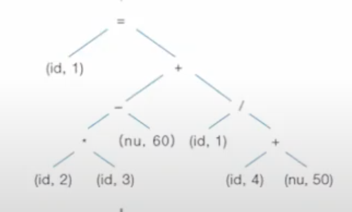
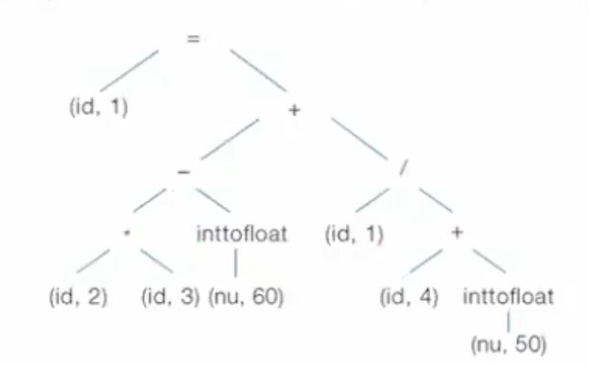

# 1강

- 기계어 vs 어셈블리어
  - 기계어 - 0101010
  - 어셈블리어 - 기계어의 가독성을 올리기 위한 저급 언어
- 어셈블러 vs 컴파일러
  - 어셈블러 - 어셈 to 기계어
  - 컴파일러 - 고급언어 to 저급언어
- `call by ref` vs `call by val` vs `call by name`
- block structure -> stack이 있어야
- array vs record
- 2 pass assembler
  - `1pass` - symbol table 작성(식별자 이름 - 주소)
  - `2pass` - opcode to 기계어


# 2강

1. Scanning or Lexical anal (**어휘 분석)**
   - `input` : sentence
   - `output` : '토큰'
2. Parging or Syntax anal (**구문 분석**)
   - `input` : 토근
   - `output` : (문법에 맞으면) 파스트리, 구문트리, (문법에 안 맞으면) err msg
     - 파스트리 : 토큰이 터미널 노드인 트리
3. Semantic anal (**의미 분석**)
   - type chk
   - 파스트리에 attr를 추가
   - `input` : 파스트리
   - `output` : annotated 파스트리
4. Intermediate code
   - target machine에 dependant하지 않는 코드
5. Code opti
   - machine dependent opti, machine independent opti
   - local opti, global opti
6. Code gen
   - `input` : intermediate code
   - `output` : 기계어, 어셈블리어


예시 )

1. Scanning or Lexical anal (**어휘 분석**)

   - res = (id, 1), (=, ~), (id, 2),  ...
     - 여기서 번호는 identifier의 번호임. sym tab에 저장되어 있음

2. Parging or Syntax anal (**구문 분석**)

   - res = 

     

3. Semantic anal (**의미 분석**)

   - res = 

     

4. Intermediate code

   - res =

     ```shell
     t1 = id2 * id3
     t2 = intotofloat(60)
     .
     .
     id1 = t7
     ```

5. Code opti

   - 위 코드 줄어듦

6. Code gen

   ```assembly
   LOAD R1, id2
   LOAD R2, id3
   .
   .
   ```

   


# 3강

- `Alphabet`
  - 정의 : set of 기호
  - 표기 : $\Sigma$
- `String`
  - 정의 : seq of alphabet
  - Empty string 정의
    - 표기 : $\epsilon$
  - 연산
    - $w^R$ : reverse
    - $w^n$ : 거듭제곱
    - Prefix(string)
- `Language` : $\Sigma^*$의 부분집합
  - 연산
    - $\cup$ 
    - *
    - 거듭제곱 : recursive하게 정의
      1. $L^0\coloneqq {\epsilon}$
      2. $L^n\coloneqq LL^{n-1}$
         - $L^*$
         - $L^+$
- `Grammar`
  - G = ($V_n, V_T, P, S$)
  - 표기 : L(G)

# 4강

- Chomsky hierarchy
  - type 0 : 제약 없
    - 튜링머신이 생성할 수 있음
  - type 1 : aA -> bb
    - CSL(Context Sensitive Language) 
    - linear bdd non-determinstic 튜링 머신이 생성할 수 있음
  - type 2 : A -> aa
    - LHS에 논터미널 달랑하나
    - CFL(Context Free Grammar) 
    - Non determinstic pushdown automata가 생성할 수 있음
  - type 3 :
    - A -> tB
    - A -> t
    - Finite State Automata가 생성할 수 있음

- Notations for Grammar
  1. Reg expr
  2. Syntax Diagram
  3. BNF
  4. EBNF


