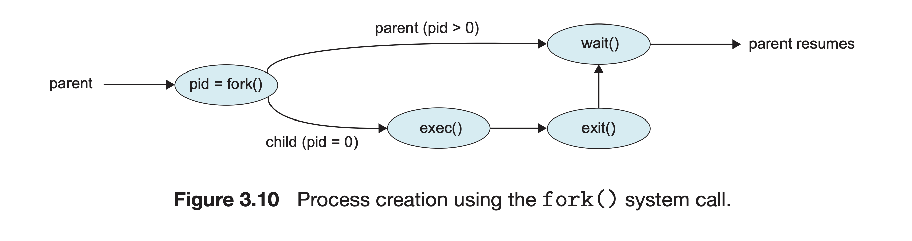

# 2강

- OS의 정의

  - OS : sw pragram that 하드웨어와 컴퓨터 user 자원을 효율적으로 interaction
    - `usr view` : program for ease of view and performance
    - `sys view` : program for resource allocation, control

- 컴퓨터 구조

  - CPU와 device가 각각 비동기적으로 움직이고, 서로 bus로 소통하며, 중간 결과가 MEM에 기록되는 방식
  - CPU가 도대체 언제 device의 operation이 끝나는지 알 수 있을까? => **interrupt**

- `Interrupt`

  - HW 관점에서의 interrupt

    - IRQ - PIC - CPU 
    - IRQs are mapped by PIC to generate interrupts to CPU
      - IRQ 몇 번이 발생했습니다!

  - SW 관점에서의 interrupt

    - CPU가 `interrupt vector table`을 확인함

    - | IRQ    | address |
      | ------ | ------- |
      | 0번 IRQ | 1000번지  |
      | 1번 IRQ | 2030번지  |
      | ..     | ..      |

      위의 주소로 점프하면, service routine으로 점프하는 것
      
    - Interrupt Service Routine(= ISR = Interrupt Handler)

  

- Storage

  - Main MEM 
    - RAM
    - `volatile`
  - Secondary Storage
    - HDD -> seek time + rotational latency + read / write time
    - SSD
    - `non-volatile`

- 단위

  - K -> M -> G -> T : 2^10씩 곱해짐

- Storage Hierarchy

  - Primary Storage
    - reg
    - cache
    - main MEM
  - Secondary Storage
    - non-volatile MEM
    - HDD, SSD

- Caching

  - cache management
  - consistency

- `DMA (Direct Memory Access)`

  CPU에서 device로 I/O request가 왔을 때!

  - data 하나 메모리에 옮기고 CPU에 interrupt 거는게 아님. 이 방식은 CPU에 부하가 심함
  - device contoller가 data를 CPU 개입없이 `DMA buffer`에다가 싹 다 옮기고
  - 다 옮기면 CPU에 interrupt
  - 그러면 CPU가 data를 `DMA buffer`에서 줏어옴

- Multiprogramming vs Multi tasking

  - Multi programming
    - multiple한 job들이 동시에 MEM에 올라 와서 수행되는 환경
    - job scheduling
  - Multi tasking
    - time-sharing
    - interactive computing
    - process
    - CPU scheduling
    - swapping
    - `virtual MEM` : MEM에 프로그램 통째로 안 옮기고도, program 돌릴 수 있음!
  - Multi 프로그래밍은 CPU가 쉬지 않게 하는 방법
  - Multi 태스킹은 마치 동시에 여러 프로그램이 돌아가는 것처럼 illusion을 주는 방법

# 3강

- OS operation for **Protectoin** (incorrect, malicious 접근에 대한)
  - Dualmode operation
    - 모드가 2개 (usr mode, kernel mode)
  - I/O protection
    - 오직 sys call 만으로 IO를 제어하도록
  - MEM
    1. Interrupt vector, Interrupt Service Routine(ISR) 아무나 못바꾸게!
    2. base + limit 개념으로 프로그램마다 독자적인 메모리 영역을 쓰게 함
  - Timer
    - 타이머가 항상 돌면서 주기적으로 timer에 대한 interrupt를 발생시킴
      - ex ) time sharing

- **OS services and SystemCalls**
  - C프로그램이 라이브러리를 통해 sys call을 부르면, (이를테면 read())
  - `interrupt vector table`로 간 다음에 (사용자가 라이브러리로 interrupt를 걸었어 -> x80위치로)
  - `system call table`로 감 (read service야)
- System Call parameter passing
  - param을 reg에 직접 넣음
  - param을 MEM에 넣고 주소를 reg에
  - Stack에 주고 pop pop 해서 사용

- System Boot
  - Power on! 하면 `Boot Loader`가 운영체제 로딩해서 수행시킴 -> 2 step
  - 1 step - **ROM**에 있는 코드 실행
    - **POST**(Power On Self Test)
      - device에 문제 없는지 chk
    - Boot device Selection
      - 부팅 디스크 HDD로? SSD로? usb로? CDROM으로? 네트워크로?
  - 2 step - **MBR**(Master Boot Record)에 있는 코드 실행
    - read MBR of Boot Device and -> 실행
      - MBR에 적힌 코드가 하는 일 
        - 어떤 운영체제가 부팅을 할지를 결정 
        - 그 운영체제가 돌아가기 위한 기본적인 셋팅, 초기화

- OS Structure
  - **monotholic**한 구조 (큰 한 덩어리)
    - ex ) UNIX
  - **micro-kernel** (OS를 아주 작게 만들어놓고 웬만한건 usr space에 밀어 넣음)
    - ex ) MAC OS, 안드로이드
    - 커널 아키텍쳐 이식은 편함
    - secure 좋음 (커널 털리면 다 털리는건데 그게 사이즈가 작으니)
    - usr space, kernel space 왔다갔다해야되서 속도에서 손해

# 4강

- **Virtual Machine**

  - 정의 : abstract hw that 여러 개의 기계를 돌리는 것처럼 illusion을 주는

  - 이점

    - 운영체제 복제도 가능
    - (이를테면, 서버 컴퓨터) CPU Utilization을 극대화

  - 환경의 종류

    - Navive VM

      - virtual machine monitor(VMM)를 bare machine 바로 위에 올림

    - Hosted VM

      - hw위에 -> host OS 위에 -> 올림

        

**end of ch2 : System Structure**

**start of ch3 : Process**

- Procss (= Job = Task)
  -  정의
    - `정의` : Program in execution
    - `Program`은 Disk에 있는 binary file일 뿐
  - 구성
    - `stack` - local variables
    - `heap` - dynamic allocation
    - `data` - global var
    - `code` - 어셈블리 명령어들

- Process State
  - `new`
  - `ready` (new에서 메모리에 올라가면 = admitted)
  - `running`
  - `waiting`
  - `terminated`

- **PCB**(Process Control Block) - 프로세스 관리하는 자료구조
  - process 의 context들(pid, state, program counter, mem limits, ..)이 저장되어 있다.

- Process Scheduling
  - `I/O bound process`
  - `CPU bound process`
  - I/O bound process를 잔뜩 MEM에 올려놓는 것은 CPU utilization을 극대화하는 방향이 아님
- Scheduling Queues
  - PCB1 - PCB2 - .. PCB10
  - `Ready Queue` : 레디상태의 PCB들 줄줄이..
  - `I/O Wait Queue` (= `Device Queue`) : wait 상태의 PCB들이 줄줄이..
- **Scheduler**
  - Queue의 Process들을 순서대로 돌려가면서 수행하는 기능 외에
  - (프로세스를 위한 메모리 공간 모자라다면) Process를 골라서 외부(디스크)로 뱉어낼 수도 있다. (`swap out`)
- Context Switch
  - `Context` : PCB에 들어있는 프로세스와 관련된 정보
  - 기본적으로 오버헤드임

# 5강

- Operations : Process **Creation** in Unix
  - `fork()`

  - `chd process`는 consists of **a cpy of the addr space** of the `par process`

  - `exec()`

    - chd의 code 공간을 싹 지우고, new program 실행

    - 이를테면, main()에서 수행한 fork()는 code 공간에 main의 내용이 써져 있다가, `execlp("/bin/ls", "ls", NULL)`을 수행하면서 main의 내용을 지우고, ls의 내용을 적는다.

      

      

- Operations : Process **Termination** in Unix

  - `reparent` 정책을 쓰고 있음.
    - 부모 죽으면 자식 뭉탱이들 연쇄적으로 다 죽는 `cascading termination` 정책도 있긴함.

  

- `Zombie` vs `Orphan`
  - zombie
    - 자식 exit() 했는데, 부모가 wait(&status)로 자식의 종료를 받아주질 아니함
  - orphan
    - 자식이 실행 중인데 부모가 먼저 죽어버림

- Address Space
  - process1과 process2가 각각 독립된 code, data, heap, stack의 4GB 공간을 갖는것처럼 생각해도 되게끔 함. (physical한 개념은 아니고, logical, virtual의 개념)
  - 그럼 실제 physical하게는 어떻게 관리되고 있느냐
  - process에 사용되는 메모리공간이 `page` 단위로 잘개 쪼개져서 `frame` 형태로 `physical` 메모리에 올라가 있음.
    - => 실제 4GB가 없어도 됨.

 

